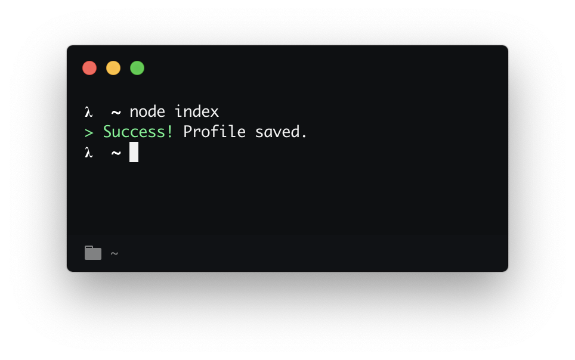

# shout-success [](https://travis-ci.org/bukinoshita/shout-success)

> An opinionated success message



## Install

```
$ yarn add shout-success
```

## Usage

```js
const { shoutSuccess } = require('shout-success')

shoutSuccess('Profile saved.')
```

_Uses [chalk](https://github.com/chalk/chalk), will return a success message with a nice color._

## API

### shoutSuccess(message, label)

#### message

Type: `string`<br>
Required

#### label

Type: `string`<br>
Default: `> Success!`

## Related

- [shout-message](https://github.com/bukinoshita/shout-message) — An opinionated message
- [shout-error](https://github.com/bukinoshita/shout-error) — An opinionated error message

## License

MIT © [Bu Kinoshita](https://bukinoshita.io)
